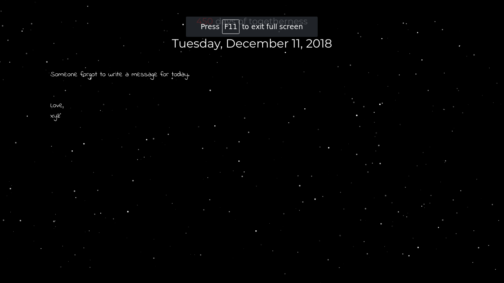

# A Note A Day :sparkles::sparkles:
Leave a special note that your loved one can read everyday.

A small project I made for my girlfriend for our long distance relationship.

:star: The idea is to write a special personalised note for your loved one everyday. 
:star: You can write notes for multiple days or just write the note for tomorrow it's up to you. 
:star: Once the notes are written the script will handle things. 
:star: You can also add a Anniversary Date to show `days of togetherness`

## How to Use
- Clone this repository.
- Change the variables in `messages.js` according to your needs.
- Personalise the look if you want.
- Deploy using github pages (Or any other hosting you find convenient)
- Add messages for your loved ones to read and push it to the remote repository for deployment.

## Potential Improvements
- [ ] Make a webapp covering all the functionality.
- [ ] Reminders to write/read notes.
